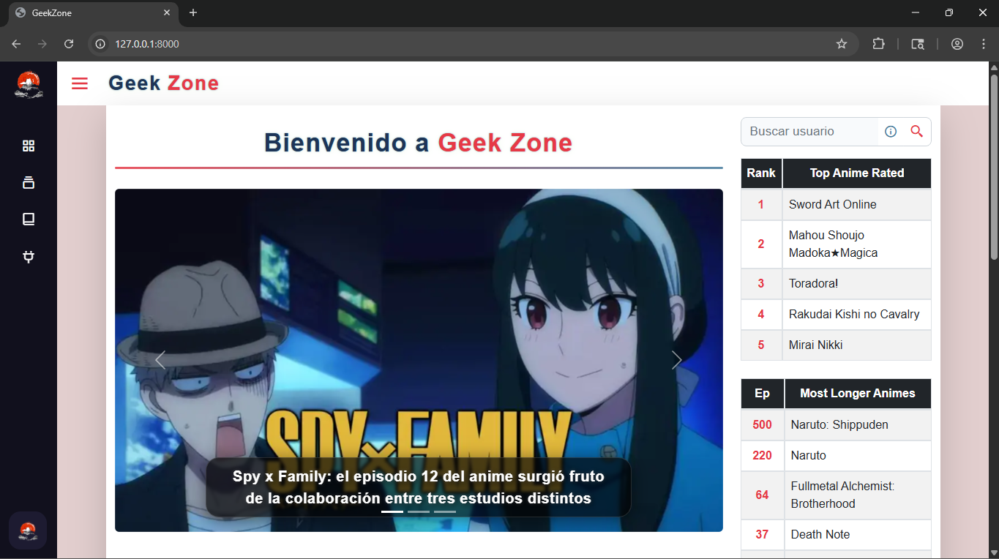
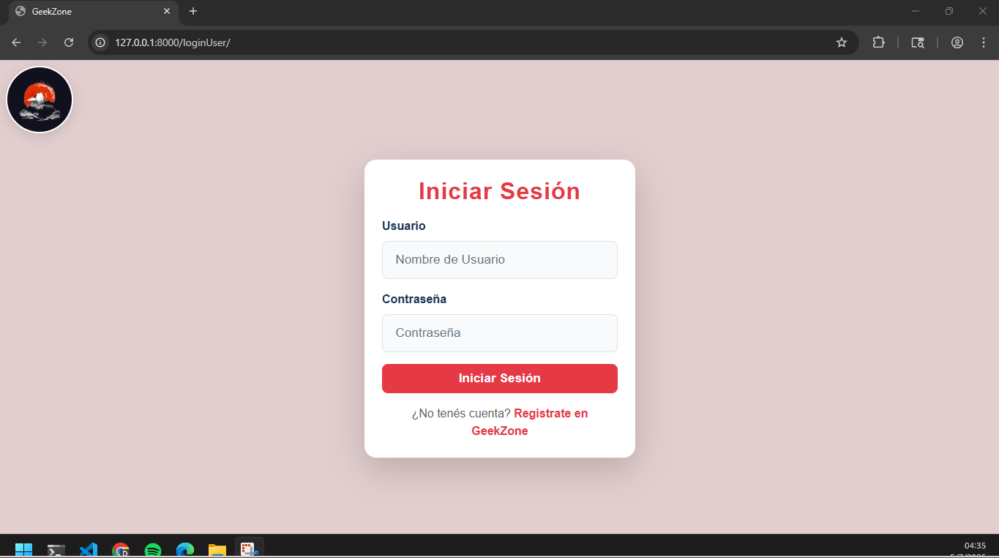
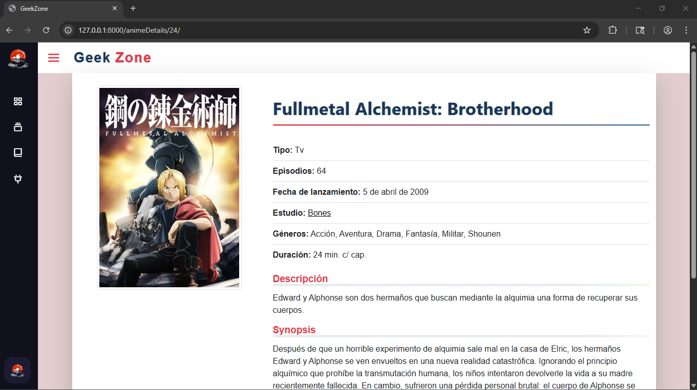
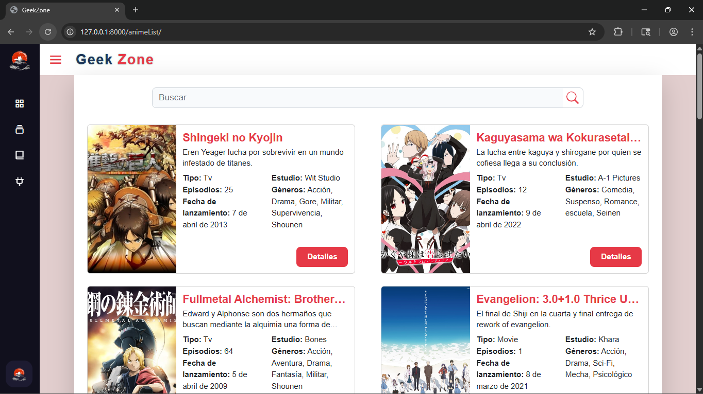

# 📄 Proyecto Final - Curso de Python (Coderhouse)

## Español

Trabajo realizado por Gino Giorgi y Facundo Jauregui como proyecto final del curso de Python en Coderhouse.

### Funcionalidades

1. **Registro y autenticación de usuarios**: Permite a los usuarios crear una cuenta, iniciar sesión y cerrar sesión de manera segura.
2. **Visualización y edición de perfil**: Cada usuario puede ver y editar su perfil, incluyendo imagen y biografía.
3. **CRUD de animes**: Los administradores pueden crear, leer, actualizar y eliminar registros de animes.
4. **CRUD de mangas**: Los administradores pueden crear, leer, actualizar y eliminar registros de mangas.
5. **CRUD de estudios**: Los administradores pueden crear, leer, actualizar y eliminar estudios de animación.
6. **Listado y búsqueda avanzada**: Los usuarios pueden buscar y filtrar animes, mangas y estudios por nombre.
7. **Detalle de objetos**: Cada anime, manga y estudio tiene una página de detalles con información ampliada y enlaces relacionados.
8. **Noticias y novedades**: Sección de noticias donde se publican novedades relevantes, con detalle y listado.
9. **Ranking y estadísticas**: Visualización de rankings como animes más populares, más largos y mejor puntuados.
10. **Navegación intuitiva y diseño responsivo**: Interfaz moderna, barra lateral adaptable, navegación rápida y experiencia optimizada para dispositivos móviles.

### Responsabilidades de cada integrante

#### Gino Giorgi:

-   Desarrollo de las vistas de la página principal
-   Funcionalidades de login, logout y registro
-   Visualización y edición del perfil de usuario

#### Facundo Jauregui:

-   Implementación de operaciones CRUD sobre las tablas de la base de datos
-   Listados y búsquedas de animes, mangas y estudios

## English

Project developed by Gino Giorgi and Facundo Jauregui as the final project for the Python course at Coderhouse.

### Features

1. **User registration and authentication**: Allows users to create an account, log in, and log out securely.
2. **Profile viewing and editing**: Each user can view and edit their profile, including image and bio.
3. **Anime CRUD**: Admins can create, read, update, and delete anime records.
4. **Manga CRUD**: Admins can create, read, update, and delete manga records.
5. **Studios CRUD**: Admins can create, read, update, and delete animation studios.
6. **Advanced listing and search**: Users can search and filter anime, manga, and studios by name.
7. **Object detail pages**: Each anime, manga, and studio has a detail page with extended information and related links.
8. **News and updates**: News section where relevant updates are published, with detail and listing.
9. **Ranking and statistics**: View rankings such as most popular, longest, and top-rated anime.
10. **Intuitive navigation and responsive design**: Modern interface, adaptable sidebar, fast navigation, and optimized experience for mobile devices.

### Individual Contributions

#### Gino Giorgi:

-   Development of the main page views
-   Login, logout, and user registration functionalities
-   User profile display and editing

#### Facundo Jauregui:

-   CRUD operations for the database tables
-   Listings and search features for anime, manga, and studios

## 📷 Fotos / Photos

### 1. Página principal / Home

### 2. Página de login

### 3. Detalle de anime

### 4. Listado de animes

### 5. Perfil de usuario

