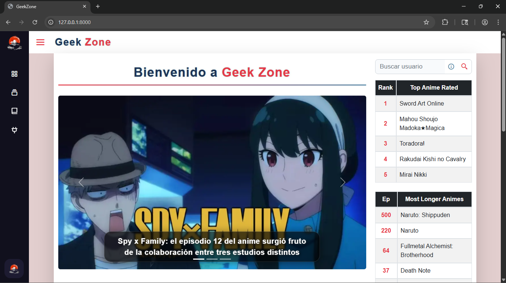
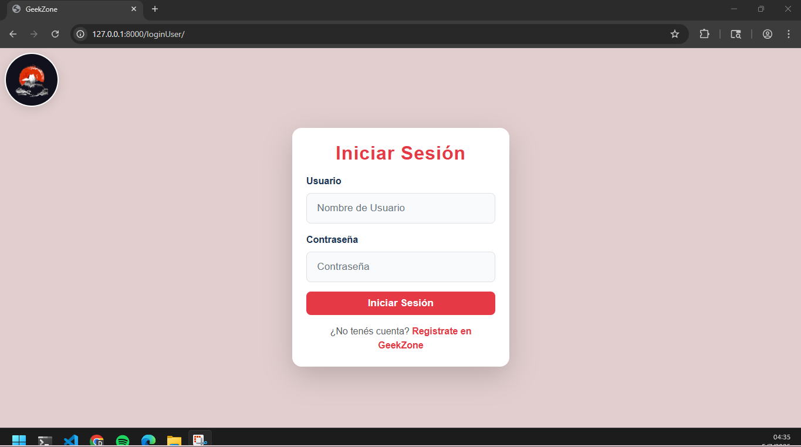
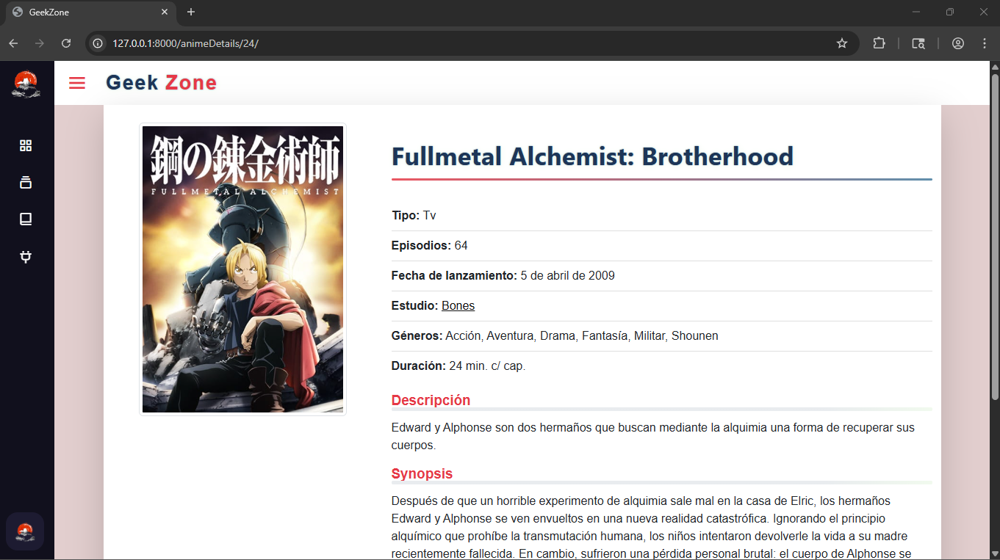

# Anime & Manga Database — Python Final Project

A full-stack web app for managing and exploring anime, manga and animation studios. Built as the final project for the Python course at Coderhouse.

**Authors:** Gino Giorgi · Facundo Jauregui

> Demo credentials — Admin: `admin` / `admin`

## Features

- User registration, login and profile management (avatar + bio)
- Anime, manga and studio CRUD (admin only)
- Search and filtering by name
- Rankings: most popular, longest and highest-rated anime
- News section with articles
- Fully responsive

## Stack

- Python + Django
- SQLite
- HTML + CSS + Bootstrap

## Run locally

```bash
pip install -r requirements.txt
python manage.py migrate
python manage.py runserver
```

## Screenshots

| Home | Login | Anime detail |
|---|---|---|
|  |  |  |
